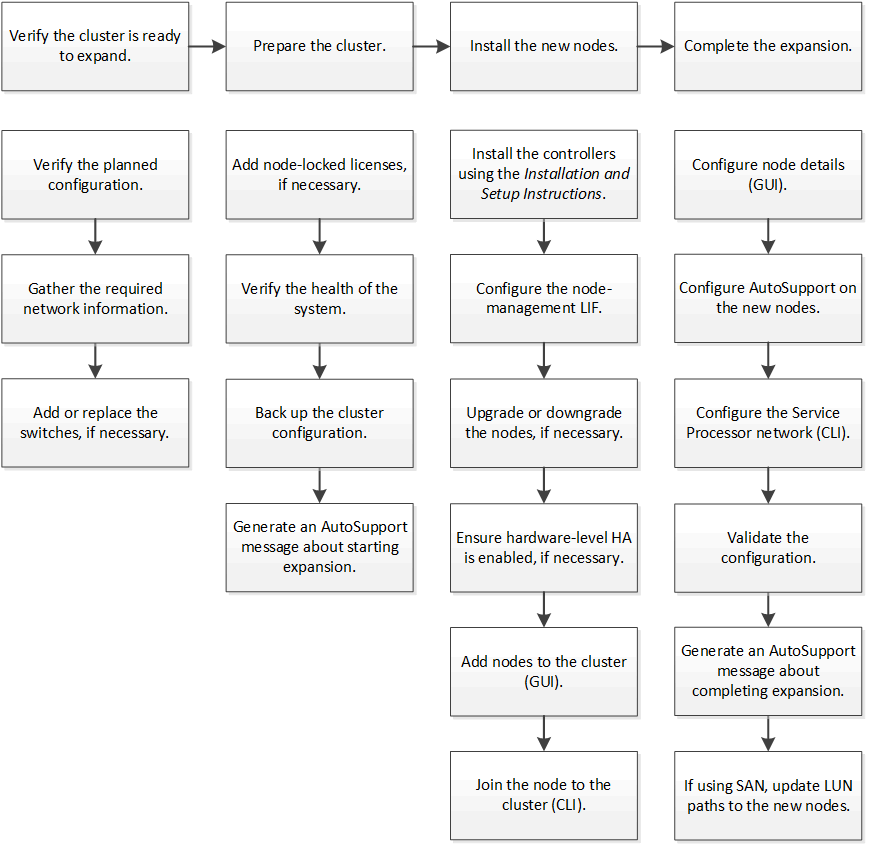

= Cluster expansion workflow
:icons: font
:imagesdir: ../media/

[.lead]
Adding two nodes to an existing cluster involves verifying that the cluster is ready for expansion, preparing the cluster, installing the new nodes, and completing the expansion.

