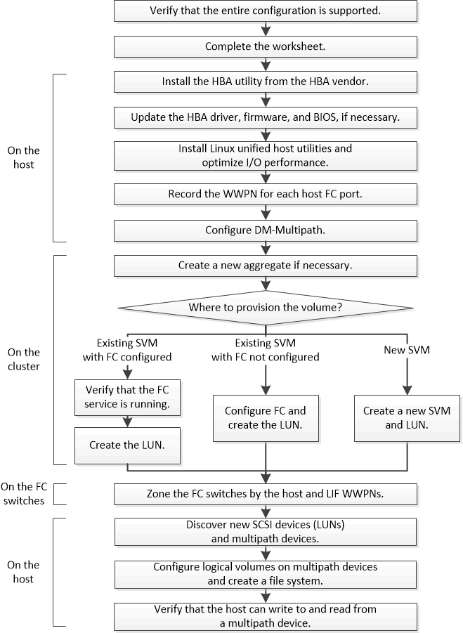

= FC configuration and provisioning workflow
:icons: font
:imagesdir: ../media/

[.lead]
When you make storage available to a host using FC, you provision a volume and LUN on the storage virtual machine (SVM), and then connect to the LUN from the host.

