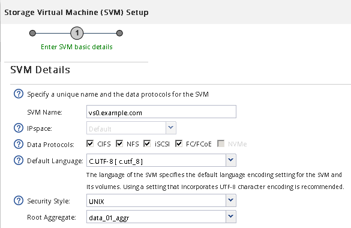
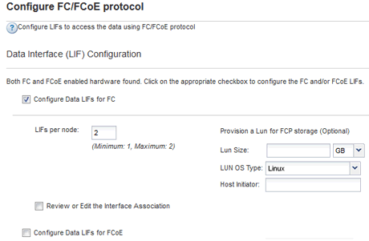

= Create a new SVM
:icons: font
:imagesdir: ../media/

[.lead]
The storage virtual machine (SVM) provides the FC target through which a host accesses LUNs. When you create the SVM, you also create logical interfaces (LIFs) and the LUN and its containing volume. You can create an SVM to separate the data and administration functions of a user from those of the other users in a cluster.

.Before you begin

* Your FC fabric must be configured and the desired physical ports must be connected to the fabric.

.Steps

. Navigate to the *SVMs* window.
. Select *Create*.
. In the *Storage Virtual Machine (SVM) Setup* window, create the SVM:
+

 .. Specify a unique name for the SVM.
+
The name must either be a fully qualified domain name (FQDN) or follow another convention that ensures unique names across a cluster.

 .. Select the IPspace that the SVM will belong to.
+
If the cluster does not use multiple IPspaces, the "`Default`" IPspace is used.

 .. Keep the default volume type selection.
+
Only FlexVol volumes are supported with SAN protocols.

 .. Select all of the protocols that you have licenses for and that you might use on the SVM, even if you do not want to configure all of the protocols immediately.
+
Selecting both NFS and CIFS when you create the SVM enables these two protocols to share the same LIFs. Adding these protocols later does not allow them to share LIFs.
+
If CIFS is one of the protocols you selected, then the security style is set to NTFS. Otherwise, the security style is set to UNIX.

 .. Keep the default language setting C.UTF-8.
 .. Select the desired root aggregate to contain the SVM root volume.
+
The aggregate for the data volume is selected separately in a later step.

 .. Select *Submit & Continue*.

+
The SVM is created, but protocols are not yet configured.

. If the *Configure CIFS/NFS protocol* page appears because you enabled CIFS or NFS, select *Skip* and then configure CIFS or NFS later.
. If the *Configure iSCSI protocol* page appears because you enabled iSCSI, select *Skip* and then configure iSCSI later.
. Configure the FC service and create LIFs, and the LUN and its containing volume from the *Configure FC/FCoE protocol* page:
 .. Select the *Configure Data LIFs for FC* check box.
 .. Enter `2` in the *LIFs per node* field.
+
Two LIFs are required for each node to ensure availability and data mobility.

 .. In the *Provision a LUN for FCP storage* area, enter the desired LUN size, host type, and WWPNs of the host initiators.
 .. Select *Submit & Continue*.

+

. When the *SVM Administration* appears, configure or defer configuring a separate administrator for this SVM:
 ** Select *Skip* and configure an administrator later if desired.
 ** Enter the requested information, and then select *Submit & Continue*.
. Review the *Summary* page, record the LIF information, and then select *OK*.
