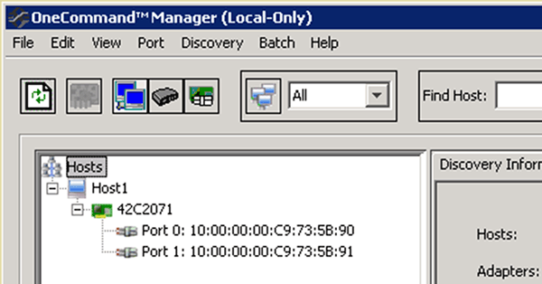

= Record the WWPN for each host FC port
:icons: font
:imagesdir: ../media/

[.lead]
The worldwide port name (WWPN) is required to zone the FC switches and to create the igroups that allow the host to access its LUN.

.Before you begin

You must have installed the vendor's HBA utility for the HBAs in your host and verified HBAs are running supported driver, firmware, and BIOS versions for your configuration.

.About this task

The WWPN is used for all configuration. You do not have to record the worldwide node name (WWNN).

.Steps

. Run the HBA utility for your FC HBA type.
. Select the HBA.
. Record the WWPN of each port.
+
The following example shows Emulex HBA Manager, formerly known as OneCommand Manager.
+

+
Other utilities, such as QLogic QConvergeConsole, provide the equivalent information.

. Repeat the previous step for each FC HBA in the host.
+
In Linux, you can also obtain the WWPN by running the `sanlun` utility.
+
The following example shows output from the `sanlun` command.
+
----
# sanlun fcp show adapter -v

adapter name:      host0
**WWPN:              10000000c9813a14**
WWNN:              20000000c9813a14
driver name:       lpfc
model:             LPe12002-M8
model description: Emulex LPe12002-M8 8Gb 2-port PCIe Fibre Channel Adapter
serial number:     VM84364896
hardware version:  31004549
driver version:    8.3.7.34.3p; HBAAPI(I) v2.3.b, 07-12-10
firmware version:  2.01A12 (U3D2.01A12)
Number of ports:   1
port type:         Fabric
port state:        Operational
supported speed:   2 GBit/sec, 4 GBit/sec, 8 GBit/sec
negotiated speed:  8 GBit/sec
OS device name:    /sys/class/scsi_host/host0

adapter name:      host5
**WWPN:              10000000c9813a15**
WWNN:              20000000c9813a15
driver name:       lpfc
model:             LPe12002-M8
model description: Emulex LPe12002-M8 8Gb 2-port PCIe Fibre Channel Adapter
serial number:     VM84364896
hardware version:  31004549
driver version:    8.3.7.34.3p; HBAAPI(I) v2.3.b, 07-12-10
firmware version:  2.01A12 (U3D2.01A12)
Number of ports:   1
port type:         Fabric
port state:        Operational
supported speed:   2 GBit/sec, 4 GBit/sec, 8 GBit/sec
negotiated speed:  8 GBit/sec
OS device name:    /sys/class/scsi_host/host5
----
