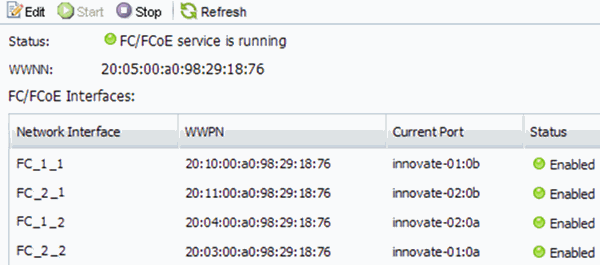

= Verify that the FC service is running on an existing SVM
:icons: font
:imagesdir: ../media/

[.lead]
If you choose to use an existing storage virtual machine (SVM), you must verify that the FC service is running on the SVM by using ONTAP System Manager. You must also verify that FC logical interfaces (LIFs) are already created.

.Before you begin

You must have selected an existing SVM on which you plan to create a new LUN.

.Steps

. Navigate to the *SVMs* window.
. Select the required SVM.
. Select the *SVM Settings* tab.
. In the *Protocols* pane, select *FC/FCoE*.
. Verify that the FC service is running.
+

+
If the FC service is not running, start the FC service or create a new SVM.

. Verify that there are at least two FC LIFs listed for each node.
+
If there are fewer than two FC LIFs per node, update the FC configuration on the SVM or create a new SVM for FC.
