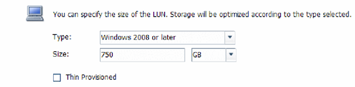

= Create a LUN
:icons: font
:imagesdir: ../media/

[.lead]
You use the Create LUN wizard to create a LUN. The wizard also creates the igroup and maps the LUN to the igroup, which enables the specified host to access the LUN.

.Before you begin

* There must be an aggregate with enough free space to contain the LUN.
* There must be a storage virtual machine (SVM) with the FC protocol enabled and the appropriate logical interfaces (LIFs) created.
* You must have recorded the worldwide port names (WWPNs) of the host FC ports.

.About this task

If your organization has a naming convention, you should use names for the LUN, volume, and so on that fit your convention. Otherwise, you should accept the default names.

.Steps

. Navigate to the *LUNs* window.
. Click *Create.*
. Browse and select an SVM in which you want to create the LUNs.
+
The Create LUN Wizard is displayed.

. On the *General Properties* page, select the LUN type *Windows 2008 or later* for LUNs used directly by the Windows host, or select *Hyper-V* for LUNs containing virtual hard disks (VHDs) for Hyper-V virtual machines.
+
Leave the *Thin Provisioned* check box unselected.
+

. On the *LUN Container* page, select an existing FlexVol volume.
+
You must ensure that there is enough space in the volume. If sufficient space is not available in the existing volumes, you can create a new volume.

. On the *Initiators Mapping* page, click *Add Initiator Group*, enter the required information on the *General* tab, and then on the *Initiators* tab, enter all the WWPNs of the host FC ports that you recorded.
. Confirm the details, and then click *Finish* to complete the wizard.

*Related information*

https://docs.netapp.com/us-en/ontap/system-admin/index.html[System administration]
