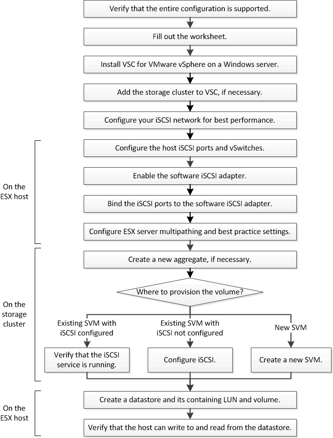

= iSCSI configuration workflow
:icons: font
:imagesdir: ../media/

[.lead]
When you make storage available to an ESXi host using iSCSI, you provision a volume and LUN on the storage virtual machine (SVM) using Virtual Storage Console for VMware vSphere, and then connect to the LUN from the host.

