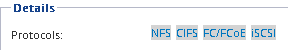

= Configuring iSCSI on an existing SVM
:icons: font
:imagesdir: ../media/

[.lead]
You can configure iSCSI on an existing storage virtual machine (SVM). The iSCSI protocol must already be enabled but not configured on the SVM. This information is intended for SVMs for which you are configuring multiple protocols, but have not yet configured iSCSI.

You must have enough network addresses available to create two LIFs for each node.

. Navigate to the *SVMs* window.
. Select the SVM that you want to configure.
. In the SVM**Details** pane, verify that *iSCSI* is displayed with a gray background, which indicates that the protocol is enabled but not fully configured.
+
If *iSCSI* is displayed with a green background, the SVM is already configured.
+

. Click the *iSCSI* protocol link with the gray background.
+
The Configure iSCSI Protocol window is displayed.

. Configure the iSCSI service and LIFs from the *Configure iSCSI protocol* page:
 .. Enter a target alias name.
 .. Enter `2` in the *LIFs per node* field.
+
Two LIFs are required for each node to ensure availability and data mobility.

 .. Assign IP addresses for the LIFs either with a subnet or without a subnet.
 .. Ignore the optional *Provision a LUN for iSCSI storage* area, because the LUN is provisioned by Virtual Storage Console for VMware vSphere in a later step.
 .. Click *Submit & Close*.
. Review the *Summary* page, record the LIF information, and then click *OK*.
