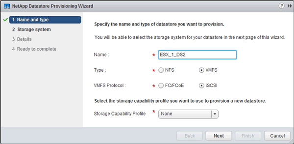

= Provision a datastore and creating its containing LUN and volume
:icons: font
:imagesdir: ../media/

[.lead]
A datastore contains virtual machines and their VMDKs on the ESXi host. The datastore on the ESXi host is provisioned on a LUN on the storage cluster.

.Before you begin

Virtual Storage Console for VMware vSphere (VSC) must be installed and registered with the vCenter Server that manages the ESXi host.

VSC must have sufficient cluster or storage virtual machine (SVM) credentials to create the LUN and volume.

.About this task

VSC automates the datastore provisioning, including creating a LUN and volume on the specified SVM.

.Steps

. From the vSphere Web Client *Home* page, click *Hosts and Clusters*.
. In the navigation pane, expand the datacenter where you want to provision the datastore.
. Right-click the ESXi host, and then select *NetApp VSC* > *Provision Datastore*.
+
Alternatively, you can right-click the cluster when provisioning to make the datastore available to all hosts in the cluster.

. Provide the required information in the wizard:
+

 ** Select *VMFS* as the datastore type.
 ** Select *iSCSI* as the VMFS protocol.
 ** Select *None* as the Storage Capability Profile.
 ** Select the box for *Thin provision*.
 ** Select the *Create new volume* check box.
