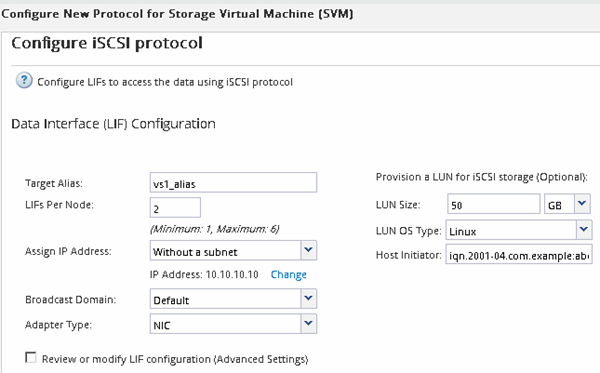

= Creating a new SVM
:icons: font
:imagesdir: ../media/

[.lead]
The storage virtual machine (SVM) provides the iSCSI target through which a host accesses LUNs. When you create the SVM, you also create logical interfaces (LIFs) and the LUN and its containing volume. You can create an SVM to separate the data and administration functions of a user from those of the other users in a cluster.

* You must have enough network addresses available to create two LIFs for each node.

LUNs are mapped to a subset of the initiators in the igroup to limit the number of paths from the host to the LUN.

* By default, ONTAP uses Selective LUN Map (SLM) to make the LUN accessible only through paths on the node owning the LUN and its HA partner.
* You still must configure all of the iSCSI LIFs on every node for LUN mobility in case the LUN is moved to another node in the cluster.
* When moving a volume or a LUN, you must modify the SLM-reporting-nodes list before moving.

. Navigate to the *SVMs* window.
. Click *Create*.
. In the *Storage Virtual Machine (SVM) Setup* window, create the SVM:
+
image::../media/svm_setup_details_page_unix_selected.gif[Illustration shows creating an SVM with UNIX security style]

 .. Specify a unique name for the SVM.
+
The name must either be a fully qualified domain name (FQDN) or follow another convention that ensures unique names across a cluster.

 .. Select the IPspace that the SVM will belong to.
+
If the cluster does not use multiple IPspaces, the "`Default`" IPspace is used.

 .. Keep the default volume type selection.
+
Only FlexVol volumes are supported with SAN protocols.

 .. Select all of the protocols that you have licenses for and that you might use on the SVM, even if you do not want to configure all of the protocols immediately.
+
Selecting both NFS and CIFS when you create the SVM enables these two protocols to share the same LIFs. Adding these protocols later does not allow them to share LIFs.
+
If CIFS is one of the protocols you selected, then the security style is set to NTFS. Otherwise, the security style is set to UNIX.

 .. Keep the default language setting C.UTF-8.
 .. Select the desired root aggregate to contain the SVM root volume.
+
The aggregate for the data volume is selected separately in a later step.

 .. Click *Submit & Continue*.

+
The SVM is created, but protocols are not yet configured.

. If the *Configure CIFS/NFS protocol* page appears because you enabled CIFS or NFS, click *Skip* and then configure CIFS or NFS later.
. Configure the iSCSI service and create LIFs, and the LUN and its containing volume from the *Configure iSCSI protocol* page:
 .. Enter a target alias name.
 .. Assign IP address for the LIFs either by using a subnet or without a subnet.
 .. Enter `2` in the *LIFs per node* field.
+
Two LIFs are required for each node to ensure availability and data mobility.

 .. In the *Provision a LUN for iSCSI storage* area, enter the desired LUN size, host type, and iSCSI initiator name of the host.
 .. Click *Submit & Continue*.

+

. If the *Configure FC/FCoE protocol* page appears because you enabled FC, click *Skip* and then configure FC later.
. When the *SVM Administration* appears, configure or defer configuring a separate administrator for this SVM:
 ** Click *Skip* and configure an administrator later if desired.
 ** Enter the requested information, and then click *Submit & Continue*.
. Review the *Summary* page, record the LIF information, and then click *OK*.
