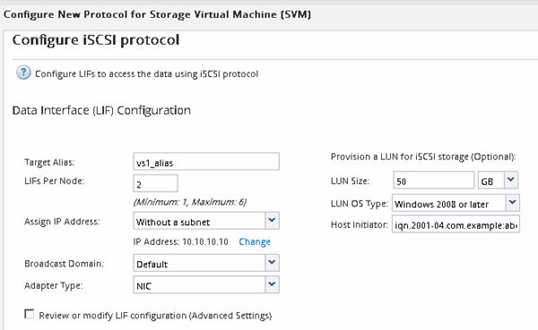

= Configure iSCSI on an existing SVM
:icons: font
:imagesdir: ../media/

[.lead]
You can configure iSCSI on an existing storage virtual machine (SVM)and create a LUN and its containing volume with a single wizard. The iSCSI protocol must already be enabled but not configured on the SVM. This information is intended for SVMs for which you are configuring multiple protocols, but have not yet configured iSCSI.

.Before you begin

You must have enough network addresses available to create two LIFs for each node.

.About this task

LUNs are mapped to a subset of the initiators in the igroup to limit the number of paths from the host to the LUN.

* ONTAP uses Selective LUN Map (SLM) to make the LUN accessible only through paths on the node owning the LUN and its HA partner.
* You still must configure all of the iSCSI LIFs on every node for LUN mobility in case the LUN is moved to another node in the cluster.
* You must modify the SLM reporting-nodes list before moving a volume or a LUN.

.Steps

. Navigate to the *SVMs* window.
. Select the SVM that you want to configure.
. In the SVM**Details** pane, verify that *iSCSI* is displayed with a gray background, which indicates that the protocol is enabled but not fully configured.
+
If *iSCSI* is displayed with a green background, the SVM is already configured.
+
image::../media/existing_svm_protocols_iscsi_windows.gif[Image shows the details page with all four protocols having gray backgrounds.]

. Click the *iSCSI* protocol link with the gray background.
+
The Configure iSCSI Protocol window is displayed.

. Configure the iSCSI service and LIFs from the *Configure iSCSI protocol* page:
 .. Enter a target alias name.
 .. Enter `2` in the *LIFs per node* field.
+
Two LIFs are required for each node to ensure availability and data mobility.

 .. Assign IP addresses for the LIFs either with a subnet or without a subnet.
 .. In the *Provision a LUN for iSCSI storage* area, enter the desired LUN size, host type, and iSCSI initiator name of the host.
 .. Click *Submit & Close*.

+

. Review the *Summary* page, record the LIF information, and then click *OK*.
