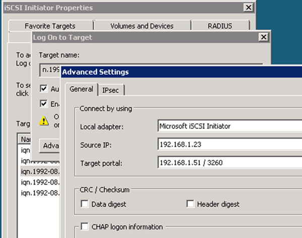

= Start iSCSI sessions with the target
:icons: font
:imagesdir: ../media/

[.lead]
The Windows host must have an iSCSI connection to each node in the cluster. You establish the sessions from the host by using the iSCSI Initiator Properties dialog box on the host.

.Before you begin

You must know the IP address of an iSCSI data LIF on the storage virtual machine (SVM) that contains the LUN you are accessing.

.About this task

In ONTAP, the iSCSI host must have paths to each node in the cluster. The native DSM selects the best paths to use. If paths fail, the native DSM selects alternate paths.

The buttons and labels in the iSCSI Initiator Properties dialog box vary between versions of Windows. Some of the steps in the task include more than one button or label name; you should pick the name that matches the version of Windows you are using.

.Steps

. Open the *iSCSI Initiator Properties* dialog box:
+
[options="header"]
|===
| For...| Click...
a|
Windows Server 2012
a|
*Server Manager* > *Dashboard* > *Tools* > *iSCSI Initiator*
a|
Windows Server 2008
a|
*Start* > *Administrative Tools* > *iSCSI Initiator*
|===

. On the *Discovery* tab, click *Discover Portal* or *Add Portal*, and then enter the IP address of the iSCSI target port.
. On the *Targets* tab, select the target you discovered, and then click *Log on* or *Connect*.
. Select *Enable multi-path*, select *Automatically restore this connection when the computer starts* or *Add this connection to the list of Favorite Targets*, and then click *Advanced*.
. For *Local adapter*, select *Microsoft iSCSI Initiator*.
+
The following example is from Windows Server 2008:
+

. For *Source IP* or *Initiator IP*, select the IP address of a port on the same subnet or VLAN as one of the iSCSI target LIFs.
. Retain the default values for the remaining check boxes, and then click *OK*.
. On the *Targets* tab, select the same target again, and then click *Log on* or *Connect*.
. Select *Enable multi-path*, select *Automatically restore this connection when the computer starts* or *Add this connection to the list of Favorite Targets*, and then click *Advanced*.
. For *Source IP* or *Initiator IP*, select the IP address of a different port on the subnet or VLAN of a different iSCSI target LIF.
. For *Target portal*, select the IP address of the iSCSI target LIF that corresponds to the port you just selected for *Source IP*.
. Retain the default values for the remaining check boxes, and then click *OK*.
. Repeat steps 8 through 12 to connect to each target LIF that is available.
