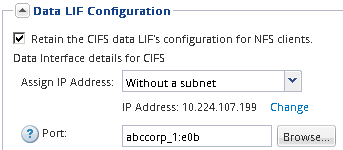
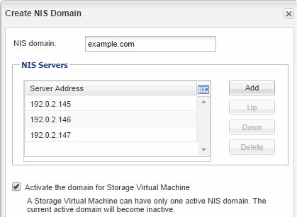

= Add CIFS and NFS access to an existing SVM
:icons: font
:imagesdir: ../media/

[.lead]
Adding both CIFS/SMB and NFS access to an existing SVM involves creating a data LIF, configuring a CIFS server, enabling NFS, and optionally configuring NIS.

== Before you begin

* You must know which of the following networking components the SVM will use:
 ** The node and the specific port on that node where the data logical interface (LIF) will be created
 ** The subnet from which the data LIF's IP address will be provisioned, or optionally the specific IP address you want to assign to the data LIF
 ** The Active Directory (AD) domain that this SVM will join, along with the credentials required to add the SVM to it
 ** NIS information if your site uses NIS for name services or name mapping
* Any external firewalls must be appropriately configured to allow access to network services.
* The time on the AD domain controllers, clients, and SVM must be synchronized within five minutes of each other.
* The CIFS and NFS protocols must be allowed on the SVM.
+
This is the case if you created the SVM while following another Express Guide to configure a SAN protocol.

== About this task

The order in which you configure CIFS and NFS affects the dialog boxes that are displayed. In this procedure, you must configure CIFS first and NFS second.

== Steps

. Navigate to the area where you can configure the protocols of the SVM:
 .. Select the SVM that you want to configure.
 .. In the *Details* pane, next to *Protocols*, click *CIFS*.
+

. In the *Data LIF Configuration* section of the *Configure CIFS protocol* dialog box, create a data LIF for the SVM:
 .. Assign an IP address to the LIF automatically from a subnet you specify or manually enter the address.
 .. Click *Browse* and select a node and port that will be associated with the LIF.
+

. In the *CIFS Server Configuration* section, define the CIFS server and configure it to access the AD domain:
 .. Specify a name for the CIFS server that is unique in the AD domain.
 .. Specify the FQDN of the AD domain that the CIFS server can join.
 .. If you want to associate an organizational unit (OU) within the AD domain other than CN=Computers, enter the OU.
 .. Specify the name and password of an administrative account that has sufficient privileges to add the CIFS server to the OU.
 .. If you want to avoid unauthorized access to all the shares on this SVM, select the option to encrypt data using SMB 3.0.

+
image::../media/svm_setup_cifs_nfs_page_cifs_ad_nas_mp.gif[This graphic is described by the surrounding text.]
. Create a volume for CIFS/SMB access and provision a share on it:
 .. Name the share that CIFS/SMB clients will use to access the volume.
+
The name you enter for the share will also be used as the volume name.

 .. Specify a size for the volume.
+
image::../media/svm_setup_cifs_nfs_page_cifs_share_nas_mp.gif[Screenshot of the area where you configure the CIFS share]

+
You do not have to specify the aggregate for the volume because it is automatically located on the aggregate with the most available space.
. Skip the *Provision a volume for CIFS Storage* area, because it provisions a volume for only CIFS access--not for multiprotocol access.
. Click *Submit & Close*, and then click *OK*.
. Enable NFS:
 .. From the SVMs tab, select the SVM for which you want to enable NFS and click *Manage*.
 .. In the *Protocols* pane, click *NFS* and then click *Enable*.
. If your site uses NIS for name services or name mapping, configure NIS:
 .. In the *Services* window, click *NIS*.
 .. In the *NIS* window, click *Create*.
 .. Specify the domain of the NIS servers.
 .. Add the IP addresses of the NIS servers.
 .. Select *Activate the domain for Storage Virtual Machine*, and then click *Create*.

+

== What to do next

You must now open the export policy of the SVM root volume.
