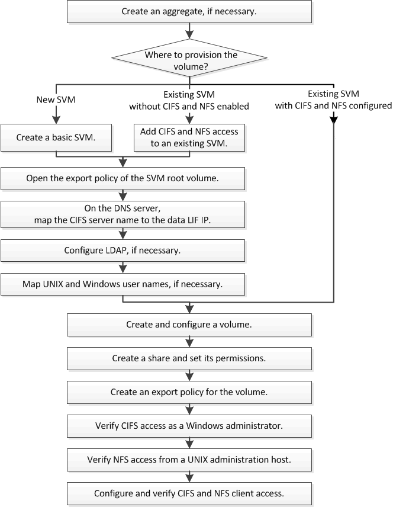

= Multiprotocol configuration workflow
:icons: font
:imagesdir: ../media/

[.lead]
Configuring both SMB/CIFS and NFS involves optionally creating an aggregate; optionally creating a new SVM or configuring an existing one; creating a volume, share, and export; and verifying access from UNIX and Windows administration hosts. You can then open access to SMB/CIFS and NFS clients.

