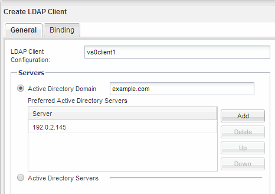
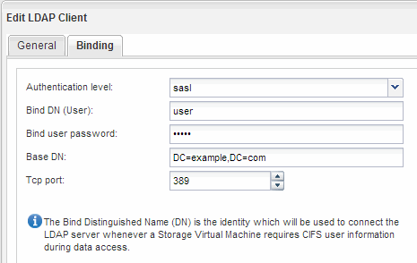
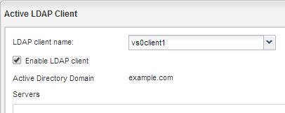
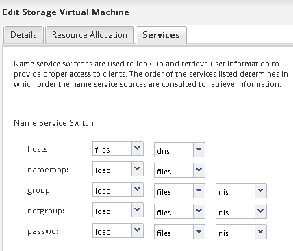

= Configure LDAP (Create a new NFS-enabled SVM)
:icons: font
:imagesdir: ../media/

[.lead]
If you want the storage virtual machine (SVM) to get user information from Active Directory-based Lightweight Directory Access Protocol (LDAP), you must create an LDAP client, enable it for the SVM, and give LDAP priority over other sources of user information.

.Before you begin

* The LDAP configuration must be using Active Directory (AD).
+
If you use another type of LDAP, you must use the command-line interface (CLI) and other documentation to configure LDAP.
+
https://www.netapp.com/pdf.html?item=/media/10720-tr-4067.pdf[NetApp Technical Report 4067: NFS in NetApp ONTAP^]
+
https://www.netapp.com/pdf.html?item=/media/19384-tr-4616.pdf[NetApp Technical Report 4616: NFS Kerberos in ONTAP with Microsoft Active Directory^]
+
https://www.netapp.com/pdf.html?item=/media/19423-tr-4835.pdf[NetApp Technical Report 4835: How to Configure LDAP in ONTAP^]

* You must know the AD domain and servers, as well as the following binding information: the authentication level, the Bind user and password, the base DN, and the LDAP port.

.Steps

. Navigate to the *SVMs* window.
. Select the required SVM
. Click the *SVM Settings* tab.
. Set up an LDAP client for the SVM to use:
 .. In the *Services* pane, click *LDAP Client*.
 .. In the *LDAP Client Configuration* window, click *Add*.
 .. In the *General* tab of the *Create LDAP Client* window, type the name of the LDAP client configuration, such as `vs0client1`.
 .. Add either the AD domain or the AD servers.
+

 .. Click *Binding*, and specify the authentication level, the Bind user and password, the base DN, and the port.
+

 .. Click *Save and Close*.

+
A new client is created and available for the SVM to use.
. Enable the new LDAP client for the SVM:
 .. In the navigation pane, click *LDAP Configuration*.
 .. Click *Edit*.
 .. Ensure that the client you just created is selected in *LDAP client name*.
 .. Select *Enable LDAP client*, and click *OK*.
+

+
The SVM uses the new LDAP client.
. Give LDAP priority over other sources of user information, such as Network Information Service (NIS) and local users and groups:
 .. Navigate to the *SVMs* window.
 .. Select the SVM and click *Edit*.
 .. Click the *Services* tab.
 .. Under *Name Service Switch*, specify *LDAP* as the preferred name service switch source for the database types.
 .. Click *Save and Close*.
+

+
LDAP is the primary source of user information for name services and name mapping on this SVM.
