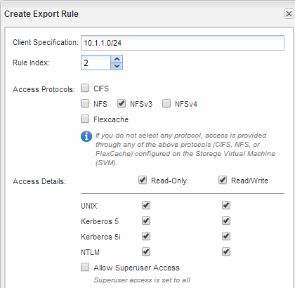

= Configure and verify CIFS and NFS client access
:icons: font
:imagesdir: ../media/

[.lead]
When you are ready, you can configure client access by setting either UNIX or NTFS file permissions, modifying the share ACL, and adding an export rule. Then you should test that the affected users or groups can access the volume.

.Steps

. Decide which clients and users or groups will be given access to the share.
. Set file permissions using a method that corresponds to the volume's security style:
+
[options="header"]
|===
| If the volume's security style is this...| Do this...
a|
NTFS
a|

 .. Log in to a Windows client as an administrator who has sufficient administrative rights to manage NTFS permissions.
 .. In Windows Explorer, right-click the drive, and then select *Properties*.
 .. Select the Security tab, and adjust the security settings for the groups and users as required.

a|
UNIX
a|
On a UNIX administration host, use the root user to set UNIX ownership and permissions on the volume.
|===

. In System Manager, modify the share ACL to give Windows users or groups access to the share.
 .. Navigate to the *Shares* window.
 .. Select the share, and click *Edit*.
 .. Select the *Permissions* tab, and give the users or groups access to the share.
. In System Manager, add rules to the export policy to permit NFS clients to access the share.
 .. Select the storage virtual machine (SVM), and click *SVM Settings*.
 .. In the *Policies* pane, click *Export Policies*.
 .. Select the export policy that is applied to the volume.
 .. In the *Export Rules* tab, click *Add*, and specify a set of clients.
 .. Select *2* for the *Rule Index* so that this rule executes after the rule that allows access to the administration host.
 .. Select *CIFS* and *NFSv3*.
 .. Specify the access details that you want, and click *OK.*
+
You can give full read/write access to clients by typing the subnet `10.1.1.0/24` as the *Client Specification*, and selecting all the access check boxes except *Allow Superuser Access*.
+

. On a Windows client, log in as one of the users who now has access to the share and files, and verify that you can access the share and create a file.
. On a UNIX client, log in as one of the users who now has access to the volume, and verify that you can mount the volume and create a file.
