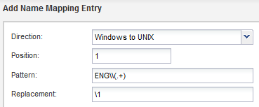
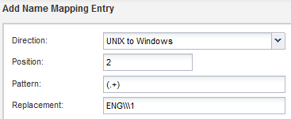
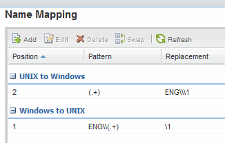

= Map UNIX and Windows user names
:icons: font
:imagesdir: ../media/

[.lead]
If your site has both Windows and UNIX user accounts, you should use name mapping to ensure that Windows users can access files with UNIX file permissions and to ensure that UNIX users can access files with NTFS file permissions. Name mapping can involve any combination of implicit mapping, conversion rules, and default users.

.About this task

You should use this procedure only if your site has Windows and UNIX user accounts that do not map implicitly, which is when the lowercase version of each Windows user name matches the UNIX user name. This can be done using NIS, LDAP, or local users. If you have two sets of users that do not match, you should configure name mapping.

.Steps

. Decide on a method of name mapping--name mapping conversion rules, default user mappings, or both--by considering the following factors:
 ** Conversion rules use regular expressions to convert one user name to another, which is useful if you want to control or track access at an individual level.
+
For example, you can map UNIX users to Windows users in a domain, and vice versa.

 ** Default users enable you to assign a user name to all users who are not mapped by implicit mappings or name mapping conversion rules.
+
Each SVM has a default UNIX user named "`pcuser`" but does not have a default Windows user.
. Navigate to the *SVMs* window.
. Select the SVM that you want to configure.
. Click the *SVM Settings* tab.
. Create a name mapping that converts UNIX user accounts to Windows user accounts, and vice versa:
 .. In the *Host Users and Groups* pane, click *Name Mapping*.
 .. Click *Add*, retain the default *Windows to UNIX* direction, and then create a regular expression that produces a UNIX credential when a Windows user tries to access a file that uses UNIX file permissions.
+
Use the following entry to convert any Windows user in the ENG domain into a UNIX user of the same name. The pattern `ENG\\(.+)` finds any Windows user name with the prefix `ENG\\`, and the replacement `\1` creates the UNIX version by removing everything except the user name.
+

 .. Click**Add**, select the *UNIX to Windows* direction, and then create the corresponding mapping that produces a Windows credential when a UNIX user tries to access a file that has NTFS file permissions.
+
Use the following entry to convert every UNIX user into a Windows user of the same name in the ENG domain. The pattern `(.+)` finds any UNIX name, and the replacement `ENG\\\1` creates the Windows version by inserting `ENG\\` before the user name.
+

 .. Because the position of each rule determines the order in which the rules are applied, you should review the result and confirm that the order matches your expectations.
+

 .. Repeat steps <<SUBSTEP_8BDAF68A77864AAFAF680961CE879940,#SUBSTEP_8BDAF68A77864AAFAF680961CE879940>> through <<SUBSTEP_E730068645DB4303B61744DB632A9803,#SUBSTEP_E730068645DB4303B61744DB632A9803>> to map all of the domains and names on the SVM.
. Create a default Windows user:
 .. Create a Windows user account in LDAP, NIS, or the local users of the SVM.
+
If you use local users, you can create an account under *Windows* in the Host Users and Groups pane.

 .. Set the default Windows user by selecting *NFS* > *Edit* in the *Protocols* pane, and entering the user name.

+
You can create a local Windows user named "`unixusers`" and set it as the default Windows user.
. Configure the default UNIX user if you want a user different from the default value, which is the "`pcuser`" user.
 .. Create a UNIX user account in LDAP, NIS, or the local users of the SVM.
+
If you use local users, you can create an account under *UNIX* in the Host Users and Groups pane.

 .. Set the default UNIX user by selecting *CIFS* > *Options* in the *Protocols* pane, and entering the user name.

+
You can create a local UNIX user named "`winusers`" and set it as the default UNIX user.

== What to do next

If you configured default users, when you configure file permissions later in the workflow, you should set permissions for the default Windows user and the default UNIX user.
