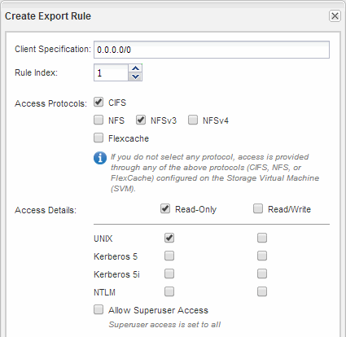

= Open the export policy of the SVM root volume (Create a new NFS-enabled SVM)
:icons: font
:imagesdir: ../media/

[.lead]
You must add a rule to the default export policy to allow all clients access through NFSv3. Without such a rule, all NFS clients are denied access to the storage virtual machine (SVM) and its volumes.

.About this task

You should specify all NFS access as the default export policy, and later restrict access to individual volumes by creating custom export policies for individual volumes.

.Steps

. Navigate to the *SVMs* window.
. Click the *SVM Settings* tab.
. In the *Policies* pane, click *Export Policies*.
. Select the export policy named *default*, which is applied to the SVM root volume.
. In the lower pane, click *Add*.
. In the *Create Export Rule* dialog box, create a rule that opens access to all clients for NFS clients:
 .. In the *Client Specification* field, enter `0.0.0.0/0` so that the rule applies to all clients.
 .. Retain the default value as *1* for the rule index.
 .. Select *NFSv3*.
 .. Clear all the check boxes except the *UNIX* check box under *Read-Only*.
 .. Click *OK*.

+

.Results

NFSv3 clients can now access any volumes created on the SVM.
