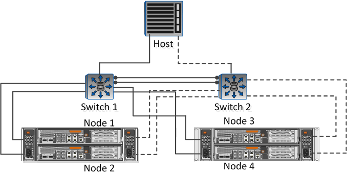

= Complete the NFS client configuration worksheet
:icons: font
:imagesdir: ../media/

[.lead]
You require network addresses and storage configuration information to perform NFS client configuration tasks.

== Target network addresses

You require a subnet with two IP addresses for NFS data LIFs for each node in the cluster. There should be two separate networks for high availability. The specific IP addresses are assigned by ONTAP when you create the LIFs as part of creating the SVM.

If possible, separate network traffic on separate physical networks or on VLANs.

Subnet for LIFs: *__**__***__**_____

|===
| Node or LIF with port to switch| IP address| Network mask| Gateway| VLAN ID| Home port
a|
Node 1 / LIF to switch 1
a|

a|

a|

a|

a|

a|
Node 2 / LIF to switch 1
a|

a|

a|

a|

a|

a|
Node 3 / LIF to switch 1
a|

a|

a|

a|

a|

a|
Node 4 / LIF to switch 1
a|

a|

a|

a|

a|

a|
Node 1 / LIF to switch 2
a|

a|

a|

a|

a|

a|
Node 2 / LIF to switch 2
a|

a|

a|

a|

a|

a|
Node 3 / LIF to switch 2
a|

a|

a|

a|

a|

a|
Node 4 / LIF to switch 2
a|

a|

a|

a|

a|

|===

== Storage configuration

If the aggregate and are already created, record their names here; otherwise, you can create them as required:

|===
a|
Node to own NFS export
a|

a|
Aggregate name
a|

a|
name
a|

|===

== NFS export information

|===
a|
Export size
a|

a|
Export name (optional)
a|

a|
Export description (optional)
a|

|===

== information

If you are not using an existing , you require the following information to create a new one:

|===
a|
name
a|

a|
Aggregate for root volume
a|

a|
user name (optional)
a|

a|
password (optional)
a|

a|
management LIF (optional)
a|
Subnet:
a|
IP address:
a|
Network mask:
a|
Gateway:
a|
Home node:
a|
Home port:
|===
