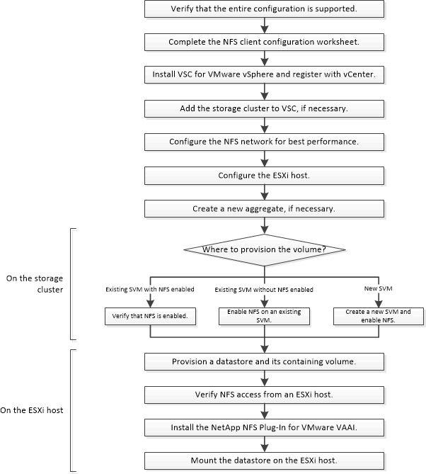

= NFS Client Configuration for ESXi workflow
:icons: font
:imagesdir: ../media/

[.lead]
When you make storage available to an ESXi host using NFS, you provision a volume on the using for and then connect to the NFS export from the ESXi host.a

