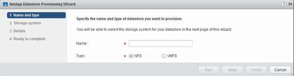

= Provisioning a datastore and creating its containing volume
:icons: font
:imagesdir: ../media/

[.lead]
A datastore contains virtual machines and their VMDKs on the ESXi host. The datastore on the ESXi host is provisioned on a volume on the storage cluster.

for (VSC) must be installed and registered with the vCenter Server that manages the ESXi host.

VSC must have sufficient cluster or credentials to create the volume.

VSC automates the datastore provisioning, including creating a volume on the specified .

. From the vSphere Web Client *Home* page, click *Hosts and Clusters*.
. In the navigation pane, expand the datacenter where you want to provision the datastore.
. Right-click the ESXi host, and then select *NetApp VSC* > *Provision Datastore*.
+
Alternatively, you can right-click the cluster when provisioning to make the datastore available to all hosts in the cluster.

. Provide the required information in the wizard:
+

