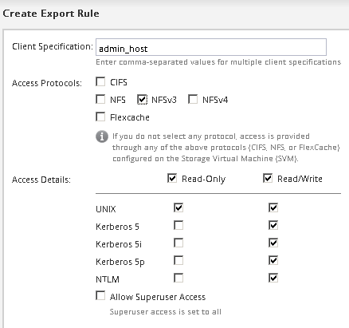

= Adding NFS access to an existing SVM
:icons: font
:imagesdir: ../media/

[.lead]
Adding NFS access to an existing SVM involves creating a data LIF, optionally configuring NIS, provisioning a volume, exporting the volume, and configuring the export policy.

== Before you begin

* You must know which of the following networking components the SVM will use:
 ** The node and the specific port on that node where the data logical interface (LIF) will be created
 ** The subnet from which the data LIF's IP address will be provisioned, or optionally the specific IP address you want to assign to the data LIF
* Any external firewalls must be appropriately configured to allow access to network services.
* The NFS protocol must be allowed on the SVM.
+
This is the case if you created the SVM while following another Express Guide to configure a SAN protocol.

== Steps

. Navigate to the area where you can configure the protocols of the SVM:
 .. Select the SVM that you want to configure.
 .. In the *Details* pane, next to *Protocols*, click *NFS*.
+
image::../media/svm_add_protocol_nfs_nfs.gif[This image is explained by the surrounding text.]
. In the *Configure NFS protocol* dialog box, create a data LIF.
 .. Assign an IP address to the LIF automatically from a subnet you specify or manually enter the address.
 .. Click *Browse* and select a node and port that will be associated with the LIF.
+
image::../media/svm_setup_cifs_nfs_page_lif_multi_nas_nfs.gif[This graphic is described by the surrounding text.]
. If your site uses NIS for name services or name mapping, specify the domain and IP addresses of the NIS servers and select the database types for which you want to add the NIS name service source.
+
image::../media/svm_setup_cifs_nfs_page_nis_area_nfs.gif[This graphic is explained by the surrounding text.]
+
If NIS services are not available, do not attempt to configure it. Improperly configured NIS services can cause datastore access issues.

. Create and export a volume for NFS access:
 .. For *Export Name*, type a name that will be both the export name and the beginning of the volume name.
 .. Specify a size for the volume that will contain the files.
+
image::../media/svm_setup_cifs_nfs_page_nfs_export_nfs.gif[Screenshot of the area where you configure the NFS export]
+
You do not have to specify the aggregate for the volume because it is automatically located on the aggregate with the most available space.

 .. In the *Permission* field, click *Change*, and specify an export rule that gives NFSv3 access to a UNIX administration host, including Superuser access.
+

+
You can create a 10 GB volume named Eng, export it as Eng, and add a rule that gives the "`admin_host`" client full access to the export, including Superuser access.
. Click *Submit & Close*, and then click *OK*.
