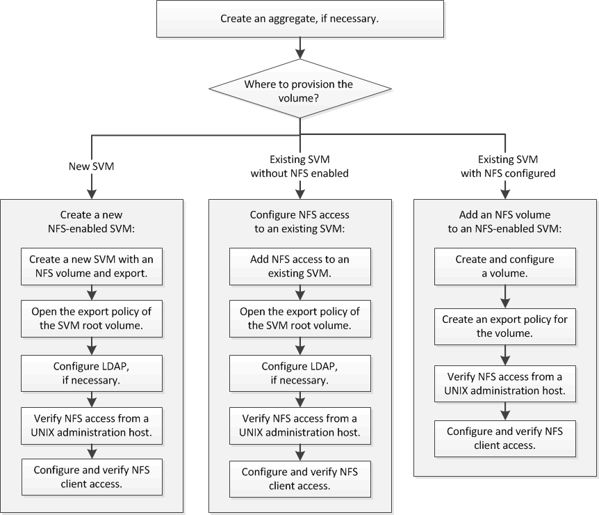

= NFS configuration workflow
:icons: font
:imagesdir: ../media/

[.lead]
Configuring NFS involves optionally creating an aggregate and then choosing a workflow that is specific to your goal--creating a new NFS-enabled SVM, configuring NFS access to an existing SVM, or simply adding an NFS volume to an existing SVM that is already fully configured for NFS access.

