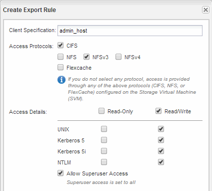

= Create an export policy for the volume
:icons: font
:imagesdir: ../media/

[.lead]
Before any NFS clients can access a volume, you must create an export policy for the volume, add a rule that permits access by an administration host, and apply the new export policy to the volume.

.Steps

. Navigate to the *SVMs* window.
. Click the *SVM Settings* tab.
. Create a new export policy:
 .. In the *Policies* pane, click *Export Policies* and then click *Create*.
 .. In the *Create Export Policy* window, specify a policy name.
 .. Under *Export Rules*, click *Add* to add a rule to the new policy.

+
image::../media/export_policy_create_nfs.gif[This screenshot is described by the preceding text.]
. In the *Create Export Rule* dialog box, create a rule that allows an administrator full access to the export through all protocols:
 .. Specify the IP address or client name, such as admin_host, from which the exported volume will be administered.
 .. Select *NFSv3*.
 .. Ensure that all *Read/Write* access details are selected, as well as *Allow Superuser Access*.
+

 .. Click *OK* and then click *Create*.

+
The new export policy is created, along with its new rule.
. Apply the new export policy to the new volume so that the administrator host can access the volume:
 .. Navigate to the *Namespace* window.
 .. Select the volume and click *Change Export Policy*.
 .. Select the new policy and click *Change*.

*Related information*

xref:task_verifying_nfs_access_from_unix_administration_host.adoc[Verifying NFS access from a UNIX administration host]
