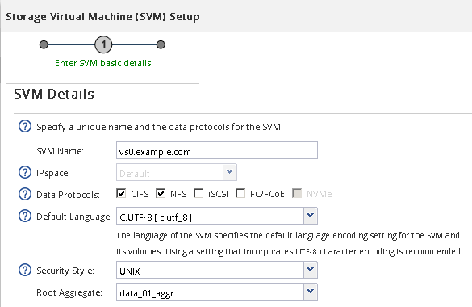
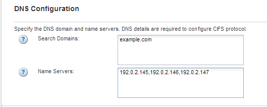
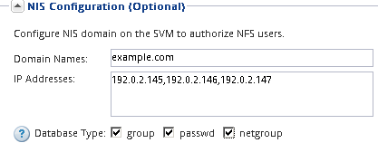
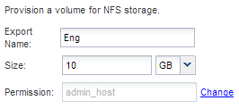

= Create a new SVM with an NFS volume and export
:icons: font
:imagesdir: ../media/

[.lead]
You can use a wizard that guides you through the process of creating the storage virtual machine (SVM), configuring Domain Name System (DNS), creating a data logical interface (LIF), enabling NFS, optionally configuring NIS, and then creating and exporting a volume.

== Before you begin

* Your network must be configured and the relevant physical ports must be connected to the network.
* You must know which of the following networking components the SVM will use:
 ** The node and the specific port on that node where the data logical interface (LIF) will be created
 ** The subnet from which the data LIF's IP address will be provisioned, or optionally the specific IP address you want to assign to the data LIF
 ** NIS information, if your site uses NIS for name services or name mapping
* The subnet must be routable to all external servers required for services such as Network Information Service (NIS), Lightweight Directory Access Protocol (LDAP), Active Directory (AD), and DNS.
* Any external firewalls must be appropriately configured to allow access to network services.
* The time on the AD domain controllers, clients, and SVM must be synchronized to within five minutes of each other.

== Steps

. Navigate to the *SVMs* window.
. Click *Create.*
. In the *Storage Virtual Machine (SVM) Setup* dialog box, create the SVM:
 .. Specify a unique name for the SVM.
+
The name must either be a fully qualified domain name (FQDN) or follow another convention that ensures unique names across a cluster.

 .. Select all the protocols that you have licenses for and that you will eventually use on the SVM, even if you do not want to configure all the protocols immediately.
+
If CIFS access is required eventually, you must select *CIFS* now so that CIFS and NFS clients can share the same data LIF.

 .. Keep the default language setting, C.UTF-8.
+
[NOTE]
====
If you support international character display in both NFS and SMB/CIFS clients, consider using the *UTF8MB4* language code, which is available beginning with ONTAP 9.5.
====
+
This language is inherited by the volume that you create later, and a volume's language cannot be changed.

 .. If you enabled the CIFS protocol, change the security style to *UNIX*.
+
Selecting the CIFS protocol sets the security style to NTFS by default.

 .. Select the root aggregate to contain the SVM root volume.
+
The aggregate that you select for the root volume does not determine the location of the data volume. The aggregate for the data volume is selected automatically when you provision storage in a later step.
+

 .. In the *DNS Configuration* area, ensure that the default DNS search domain and name servers are the ones that you want to use for this SVM.
+

 .. Click *Submit & Continue*.

+
The SVM is created, but protocols are not yet configured.
. In the *Data LIF Configuration* section of the *Configure CIFS/NFS protocol* page, specify the details of the LIF that clients will use to access data:
 .. Assign an IP address to the LIF automatically from a subnet you specify or manually enter the address.
 .. Click *Browse* and select a node and port that will be associated with the LIF.
+
image::../media/svm_setup_cifs_nfs_page_lif_multi_nas_nfs.gif[This graphic is described by the surrounding text.]
. If the *NIS Configuration* area is collapsed, expand it.
. If your site uses NIS for name services or name mapping, specify the domain and IP addresses of the NIS servers.
+

. Create and export a volume for NFS access:
 .. For *Export Name*, type a name that will be both the export name and the beginning of the volume name.
 .. Specify a size for the volume that will contain the files.
+

+
You do not have to specify the aggregate for the volume because it is automatically located on the aggregate with the most available space.

 .. In the *Permission* field, click *Change*, and specify an export rule that gives NFSv3 access to a UNIX administration host, including Superuser access.
+
image::../media/export_rule_for_admin_manual_nfs_nfs.gif[This image is explained by the surrounding text.]

+
You can create a 10 GB volume named Eng, export it as Eng, and add a rule that gives the "`admin_host`" client full access to the export, including Superuser access.
. Click *Submit & Continue*.
+
The following objects are created:

 ** A data LIF named after the SVM with the suffix "`_nfs_lif1`"
 ** An NFS server
 ** A volume that is located on the aggregate with the most available space and has a name that matches the name of the export and ends in the suffix "`_NFS_volume`"
 ** An export for the volume
 ** An export policy with the same name as the export

. For all other protocol configuration pages that are displayed, click *Skip* and configure the protocol later.
. When the *SVM Administration* page is displayed, configure or defer configuring a separate administrator for this SVM:
 ** Click *Skip* and configure an administrator later if required.
 ** Enter the requested information and then click *Submit & Continue*.
. Review the *Summary* page, record any information you might require later and then click *OK*.
+
NFS clients need to know the IP address of the data LIF.

== Results

A new SVM is created with an NFS server containing a new volume that is exported for an administrator.
