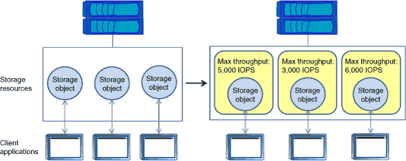

= Managing workload performance by using Storage QoS
:icons: font
:imagesdir: ../media/

[.lead]
Storage Quality of Service (QoS) can help you manage risks around meeting your performance objectives. You can use Storage QoS to limit the throughput to workloads and to monitor workload performance. You can reactively limit workloads to address performance problems, and you can proactively limit workloads to prevent performance problems.

A workload represents the input/output (I/O) operations to one of the following kinds of storage objects:

* FlexVol volumes
* LUNs
* FlexGroup volumes

You can assign a storage object to a policy group to control and monitor a workload. You can monitor workloads without controlling them.

The following illustration shows a sample environment before and after using Storage QoS. On the left, the workloads compete for cluster resources to transmit I/O. These workloads get "`best effort`" performance, which means that you have less performance predictability (for example, a workload might get such good performance that it negatively impacts other workloads). On the right, the same workloads are assigned to policy groups. The policy groups enforce a maximum throughput limit.

