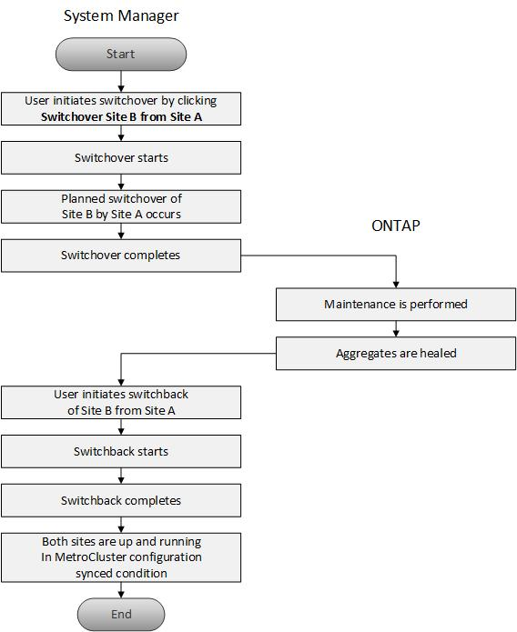

= MetroCluster switchover and switchback workflow
:icons: font
:imagesdir: ../media/

[.lead]
Starting with System Manager 9.6, you can use MetroCluster switchover and switchback operations after a disaster that renders all the nodes in the source cluster unreachable and powered off. You can also use the switchover workflow for a negotiated (planned) switchover in cases such as disaster recovery testing or a site going offline for maintenance.

The overall process for switchover and switchback workflow includes the following three phases:

. *Switchover*: The switchover process allows you to transfer control of the storage and client access from a source cluster site (Site B) to another cluster site (Site A). This operation helps you provide nondisruptive operations during testing and maintenance. In addition, this process also enables you to recover from a site failure. For disaster recovery testing or planned site maintenance, you can perform a MetroCluster switchover to transfer control to a disaster recovery (DR) site (Site A). Before you start the process, at least one of the surviving site nodes must be up and running before you perform the switchover. If a switchover operation previously failed on certain nodes on the DR site, the operation can be retried on all of those nodes.
. *Site B Operations*: After switchover is completed, System Manager completes the healing process for the MetroCluster IP configuration. Healing is a planned event, which gives you full control of each step to minimize downtime. Healing is a two-phase process that occurs on the storage and controller components to prepare the nodes at the repaired site for the switchback process. During the first phase, the process heals the aggregates by resynchronizing the mirrored plexes and then heals the root aggregates by switching them back to the disaster site.
+
In the second phase, the site is made ready for the switchback process.

. *Switchback*: After maintenance and repairs are performed on Site B, you initiate the switchback operation to return control of the storage and client access from Site A to Site B. For a successful switchback, the following conditions must exist:
 ** The home nodes and storage shelves must be powered on and reachable by nodes in Site A.
 ** System Manager must have successfully completed the healing phase before you can initiate the switchback operation.
 ** All the aggregates in Site A should be in mirrored status and cannot be in degraded or resyncing status.
 ** All previous configuration changes must be complete before performing a switchback operation. This prevents those changes from competing with the negotiated switchover or switchback operation.

== MetroCluster switchover and switchback workflow flowchart

The following flowchart illustrates the phases and processes that occur when you initiate switchover and switchback operations.

