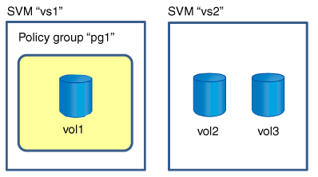
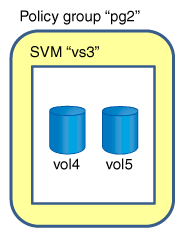

= Rules for assigning storage objects to policy groups
:icons: font
:imagesdir: ../media/

[.lead]
You should be aware of rules that dictate how you can assign storage objects to Storage QoS policy groups.

== Storage objects and policy groups must belong to the same SVM

A storage object must be contained by the SVM to which the policy group belongs. You specify the SVM to which the policy group belongs when you create the policy group. Multiple policy groups can belong to the same SVM.

In the following illustration, the policy group pg1 belongs to SVM vs1. You cannot assign volumes vol2 or vol3 to policy group pg1 because those volumes are contained by a different SVM.

== Nested storage objects cannot belong to policy groups

You cannot assign a storage object to a policy group if its containing object or its child objects belong to a policy group. The following table lists the restrictions.

[options="header"]
|===
| If you assign the...| Then you cannot assign...
a|
SVM to a policy group
a|
Any storage objects contained by the SVM to a policy group
a|
Volume to a policy group
a|
The volume's containing SVM or any child LUNs to a policy group
a|
LUN to a policy group
a|
The LUN's containing volume or SVM to a policy group
a|
File to a policy group
a|
The file's containing volume or SVM to a policy group
|===

In the following illustration, the SVM vs3 is assigned to policy group pg2. You cannot assign volumes vol4 or vol5 to a policy group because an object in the storage hierarchy (SVM vs3) is assigned to a policy group.

