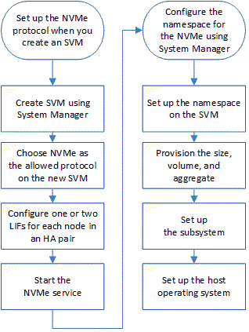

= Setting up NVMe
:icons: font
:imagesdir: ../media/

[.lead]
You can set up the NVMe protocol for an SVM using System Manager. When the NVMe protocol is enabled on the SVM, you can then provision a namespace or namespaces and assign them to a host and a subsystem.

Starting with ONTAP 9.5, you must configure at least one NVMe LIF for each node in an HA pair that uses the NVMe protocol. You can also define a maximum of two NVMe LIFs per node. You configure the NVMe LIFs when you create or edit the SVM settings using System Manager.

The following illustration shows the workflow for setting up NVMe:

