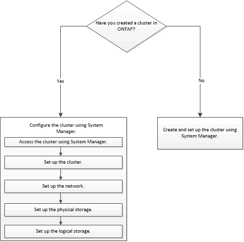

= Setting up your cluster environment
:icons: font
:imagesdir: ../media/

[.lead]
You can create a cluster by using System Manager or the command-line interface (CLI). To create a cluster by using System Manager, you must set up the node management IP address on any node in the cluster network. If you have created a cluster by using the CLI, you can configure the cluster by using System Manager.

