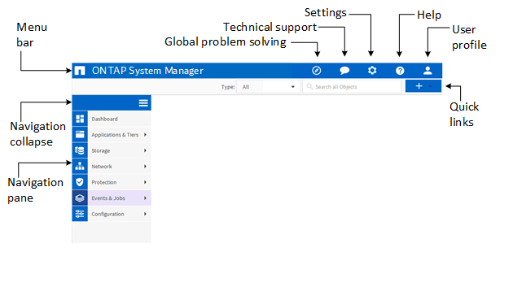

= System Manager window layout
:icons: font
:imagesdir: ../media/

[.lead]
Understanding the typical window layout helps you to navigate and use System Manager effectively.

== Typical layout of System Manager windows

