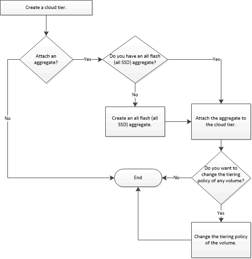

= Configuring and managing cloud tiers
:icons: font
:imagesdir: ../media/

[.lead]
Storing data in tiers can enhance the efficiency of your storage system. You manage storage tiers by using FabricPool-enabled aggregates. Cloud tiers store data in a tier based on whether the data is frequently accessed.

* You must be running ONTAP 9.2 or later.
* You must have all flash (all SSD) aggregates

