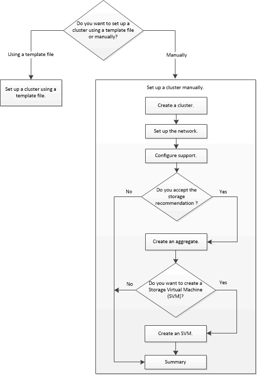

= Setting up the cluster by using ONTAP System Manager
:icons: font
:imagesdir: ../media/

[.lead]
Beginning with ONTAP 9.1, you can use ONTAP System Manager to set up a cluster by creating a cluster, setting up the node management network and cluster management network, and then setting up event notifications.

== Before you begin

* You must have configured the node management IP addresses for at least one node.
* Nodes must be in the default mode of HA.
* Nodes must be running ONTAP 9.1 or later.
* Nodes must be of the same version.
* All of the nodes must be healthy, and cabling for the nodes must be set up.
* Cabling and connectivity must be in place for your cluster configuration.
* You must have sufficient cluster management, node management, Service Processor IP addresses, and gateway and netmask details.
* If the cluster interface is present on a port, then that port must be present in the cluster IPspace.

== About this task

To create a cluster, you have to log in through the console, and configure the node management IP address on any node in the cluster network. After you have configured the node management IP address on a node, you can add other nodes and create a cluster by using ONTAP System Manager.

The cluster setup operation is not supported on MetroCluster configurations for ONTAP software.

You can set up the cluster by using a template file or by manually entering the values in the cluster setup wizard.

