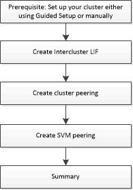

= Setting up peering
:icons: font
:imagesdir: ../media/

[.lead]
Setting up peering involves creating intercluster logical interfaces (LIFs) on each node, creating cluster peering, and creating SVM peering.

