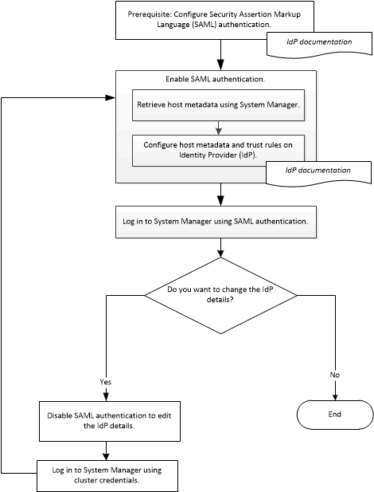

= Setting up SAML authentication
:icons: font
:imagesdir: ../media/

[.lead]
You can set up Security Assertion Markup Language (SAML) authentication so that remote users are authenticated through a secure identity provider (IdP) before they log in to System Manager.

