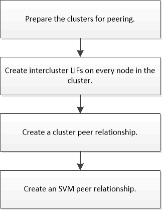

= Cluster and SVM peering workflow
:icons: font
:imagesdir: ../media/

[.lead]
Setting up a peering relationship involves preparing each cluster for peering, creating intercluster logical interfaces (LIFs) on each node of each cluster, setting up a cluster peer relationship, and then setting up an SVM peering relationship.

If you are running ONTAP 9.2 or earlier, you create an SVM peering relationship while creating a data protection relationship between the source volume and the destination volume.
