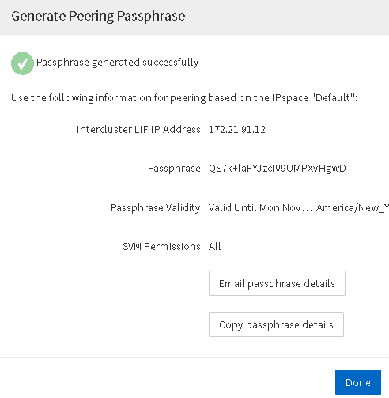

= Create a cluster peer relationship (starting with ONTAP 9.3)
:icons: font
:imagesdir: ../media/

[.lead]
You can create a cluster peer relationship between two clusters by providing a system-generated passphrase and the IP addresses of the intercluster LIFs of the remote cluster.

.About this task

Beginning in ONTAP 9.6, cluster peering encryption is enabled by default on all newly created cluster peering relationships. Cluster peering encryption must be enabled manually for peering relationship created prior to upgrading to ONTAP 9.6. Cluster peering encryption is not available for clusters running ONTAP 9.5 or earlier. Therefore, both clusters in the peering relationship must be running ONTAP 9.6 in order to enable cluster peering encryption.

Cluster peering encryption uses the Transport Security Layer (TLS) to secure cross-cluster peering communications for ONTAP features such as SnapMirror and FlexCache.

.Steps

. In the *Target Cluster Intercluster LIF IP addresses* field, enter the IP addresses of the intercluster LIFs of the remote cluster.
. Generate a passphrase from the remote cluster.
 .. Specify the management address of the remote cluster.
 .. Click *Management URL* to launch ONTAP System Manager on the remote cluster.
 .. Log in to the remote cluster.
 .. In the *Cluster Peers* window, click *Generate Peering Passphrase*.
 .. Select the IPspace, validity of the passphrase, and SVM permissions.
+
You can allow all of the SVMs or selected SVMs for peering. When a SVM peer request is generated, the permitted SVMs are automatically peered with the source SVMs without requiring you to accept the peer relationship from the remote SVMs.

 .. Click *Generate*.
+
The passphrase information is displayed.
+

 .. Click *Copy passphrase details* or *Email passphrase details*.
 .. Click *Done*.
. In the source cluster, enter the generated passphrase that you obtained in Step <<STEP_F18C02A36D1D445CA930399D2E9AAB0A,#STEP_F18C02A36D1D445CA930399D2E9AAB0A>>.
. Click *Initiate Cluster Peering*.
+
The cluster peer relationship is successfully created.

. Click *Continue*.

== What to do next

You should specify the SVM details in the SVM Peering window to continue with the peering process.
