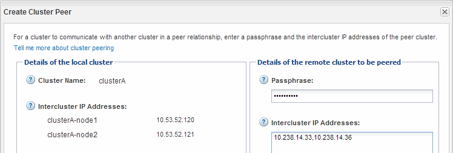
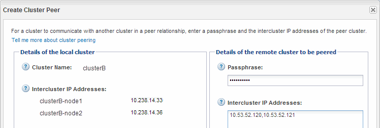
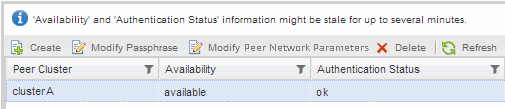

= Creating a cluster peer relationship (ONTAP 9.2 or earlier)
:icons: font
:imagesdir: ../media/

[.lead]
You can create a cluster peer relationship between two clusters by entering a predetermined passphrase and the IP addresses of the intercluster LIFs of the remote cluster, and then verifying that the relationship was created successfully.

* You must know the IP addresses of all of the intercluster LIFs of the clusters that you want to peer.
* You must know the passphrase that you will use for each peer relationship.

You must perform this procedure on each cluster.

. From the source cluster, create a cluster peer relationship with the destination cluster.
 .. Click the *Configurations* tab.
 .. In the *Cluster Settings* pane, click *Cluster Peers*.
 .. Click *Create*.
+
The Create Cluster Peer dialog box is displayed.

 .. In the *Details of the remote cluster to be peered* area, specify the passphrase that both peers will use to ensure an authenticated cluster peer relationship.
 .. Enter the IP addresses of all of the intercluster LIFs of the destination cluster (one per node) separated by commas.
+

 .. Click *Create*.
+
The authentication status is `pending` because only one cluster has been configured.
. Switch to the destination cluster, and then create a cluster peer relationship with the source cluster:
 .. Click the *Configurations* tab.
 .. In the *Cluster Settings* pane, click *Cluster Peers*.
 .. Click *Create*.
+
The Create Cluster Peer dialog box is displayed.

 .. In the *Details of the remote cluster to be peered* area, specify the same passphrase that you specified in step <<STEP_36B845A20DD84114916BBE2844EEE1F2,#STEP_36B845A20DD84114916BBE2844EEE1F2>> and the IP addresses of the intercluster LIFs of the source cluster, and then click *Create*.

+

. From the *Cluster Peers* window of the destination cluster, confirm that the source cluster is `available` and that the authentication status is `ok`.
+

+
You might have to click *Refresh* to view the updated information.
+
The two clusters are in a peer relationship.

. Switch to the source cluster, and confirm that the destination cluster is `available` and that the authentication status is `ok`.
+
You might have to click *Refresh* to view the updated information.

Create an SVM peer relationship between the source and destination SVMs while creating a data protection relationship between the source volume and the destination volume.

https://docs.netapp.com/ontap-9/topic/com.netapp.doc.exp-buvault/home.html[Volume express backup using SnapVault]

https://docs.netapp.com/ontap-9/topic/com.netapp.doc.exp-sm-ic-cg/home.html[Volume disaster recovery express preparation]
