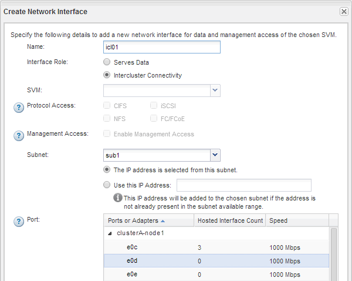

= Creating intercluster interfaces on all nodes (ONTAP 9.2 or earlier)
:icons: font
:imagesdir: ../media/

[.lead]
Clusters communicate with each other through logical interfaces (LIFs) that are dedicated to intercluster communication. You must create an intercluster LIF within each IPspace that will be used for peering, on each node in each cluster for which you want to create a peer relationship.

== Before you begin

You must have identified the subnet and ports, and optionally the IP addresses, that you plan to use for the intercluster LIFs.

== About this task

You must perform this procedure on both clusters for which you want to create a peer relationship. For example, if you have a four-node cluster that you want to peer with cluster X over IPspace A, and peer with cluster Y over IPspace Y, then you need a total of eight intercluster LIFs; Four on IPspace A (one per node), and four on IPspace Y (one per node).

== Steps

. Create an intercluster LIF on one node of the source cluster:
 .. Navigate to the *Network Interfaces* window.
 .. Click *Create*.
+
The Create Network Interface dialog box is displayed.

 .. Enter a name for the intercluster LIF.
+
You can use "`icl01`" for the intercluster LIF on the first node, and "`icl02`" for the intercluster LIF on the second node.

 .. Select *Intercluster Connectivity* as the interface role.
 .. Select the IPspace.
 .. In the *Add Details* dialog box, select *Using a subnet* from the *Assign IP Address* drop-down list, and then select the subnet that you want to use for intercluster communication.
+
By default, the IP address is automatically selected from the subnet after you click *Create*. If you do not want to use the IP address that is automatically selected, you must manually specify the IP address that the node uses for intercluster communication.

 .. If you want to manually specify the IP address that the node uses for intercluster communication, select *Use this IP Address*, and type the IP address.
+
You must ensure that the IP address that you want to use either is already available in the subnet or can be added to the subnet later.

 .. In the *Ports* area, click the node that you are configuring, and select the port that you want to use for this node.
 .. If you decided not to share ports for intercluster communication with data communication, confirm that the selected port displays "`0`" in the *Hosted Interface Count* column.
+

 .. Click *Create*.
. Repeat Step <<STEP_E3AF9C0B3C474E49A20489FF21727472,#STEP_E3AF9C0B3C474E49A20489FF21727472>> for each node in the cluster.
+
Each node in the cluster has an intercluster LIF.

. Make a note of the IP addresses of the intercluster LIFs so that you can use them later when you create peer relationships with other clusters:
 .. In the *Network Interfaces* window, in the *Role* column, click image:../media/icon_columnfilter_sm_peering.gif[Column filter icon], clear the *All* check box, and then select *Intercluster*.
+
The Network Interfaces window displays only intercluster LIFs.

 .. Note down the IP addresses that are listed in the *IP Addresses/WWPN* column, or leave the *Network Interfaces* window open so that you can retrieve the IP addresses later.
+
You can click the column display icon (image:../media/icon_columnshowhide_sm_onc_peering.gif[Icon for show or hide column]) to hide the columns that you do not want to view.

== Results

All of the nodes in each cluster have intercluster LIFs that can all communicate with each other.
