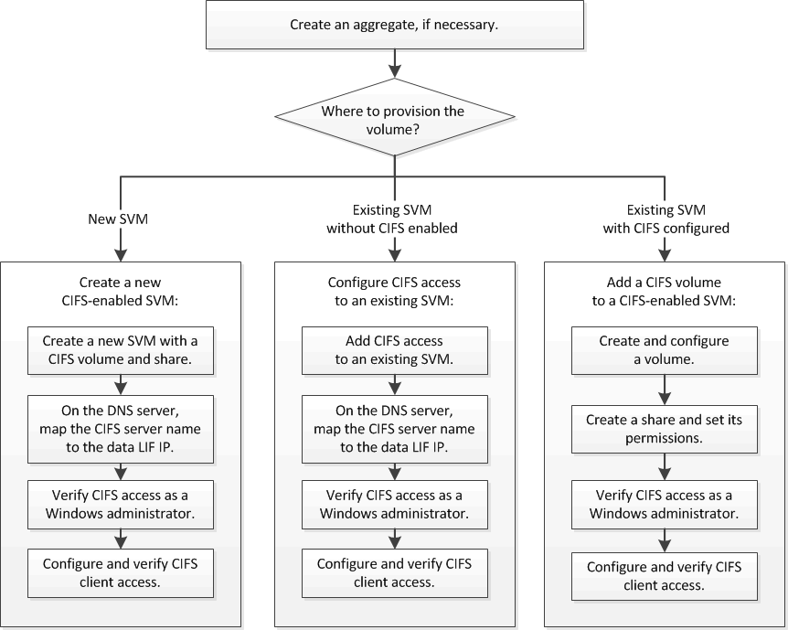

= SMB/CIFS configuration workflow
:icons: font
:imagesdir: ../media/

[.lead]
Configuring SMB/CIFS involves optionally creating an aggregate and then choosing a workflow that is specific to your goal--creating a new CIFS-enabled SVM, configuring CIFS access to an existing SVM, or simply adding a CIFS volume to an existing SVM that is already fully configured for CIFS access.

