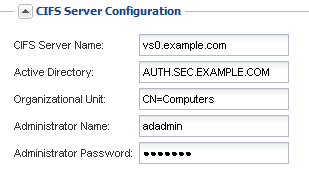
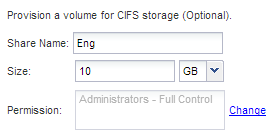

= Creating a new SVM with a CIFS volume and share
:icons: font
:imagesdir: ../media/

[.lead]
You can use a wizard that guides you through the process of creating a new storage virtual machine (SVM), configuring Domain Name System (DNS), creating a data logical interface (LIF), configuring a CIFS server, and creating and sharing a volume.

== Before you begin

* Your network must be configured and the relevant physical ports must be connected to the network.
* You must know which of the following networking components the SVM will use:
 ** The node and the specific port on that node where the data logical interface (LIF) will be created
 ** The subnet from which the data LIF's IP address will be provisioned, or optionally the specific IP address you want to assign to the data LIF
 ** Active Directory (AD) domain that this SVM will join, along with the credentials required to add the SVM to it
* The subnet must be routable to all external servers required for services such as Network Information Service (NIS), Lightweight Directory Access Protocol (LDAP), Active Directory (AD), and DNS.
* Any external firewalls must be appropriately configured to allow access to network services.
* The time on the AD domain controllers, clients, and SVM must be synchronized to within five minutes of each other.

== Steps

. Navigate to the *SVMs* window.
. Click *Create.*
. In the *Storage Virtual Machine (SVM) Setup* dialog box, create the SVM:
 .. Specify a unique name for the SVM.
+
The name must either be a fully qualified domain name (FQDN) or follow another convention that ensures unique names across a cluster.

 .. Select all the protocols that you have licenses for and that you will eventually use on the SVM, even if you do not want to configure all the protocols immediately.
+
If NFS access is required eventually, you must select *NFS* now so that CIFS and NFS clients can share the same data LIF.

 .. Keep the default language setting, C.UTF-8.
+
[NOTE]
====
If you support international character display in both NFS and SMB/CIFS clients, consider using the *UTF8MB4* language code, which is available beginning with ONTAP 9.5.
====
+
This language is inherited by the volume that you create later, and a volume's language cannot be changed.

 .. Select the root aggregate to contain the SVM root volume.
+
The aggregate that you select for the root volume does not determine the location of the data volume. The aggregate for the data volume is selected automatically when you provision storage in a later step.
+
image::../media/svm_setup_details_page_ntfs_selected_smb.gif[This graphic is explained by the surrounding text.]

 .. In the *DNS Configuration* area, ensure that the default DNS search domain and name servers are the ones that you want to use for this SVM.
+
image::../media/svm_setup_details_dns_smb.gif[This graphic is explained by the surrounding text.]

 .. Click *Submit & Continue*.

+
The SVM is created, but protocols are not yet configured.
. In the *Data LIF Configuration* section of the *Configure CIFS/NFS protocol* page, specify the details of the LIF that clients will use to access data:
 .. Assign an IP address to the LIF automatically from a subnet you specify or manually enter the address.
 .. Click *Browse* and select a node and port that will be associated with the LIF.
+
image::../media/svm_setup_cifs_nfs_page_lif_multi_nas_smb.gif[This graphic is described by the surrounding text.]
. In the *CIFS Server Configuration* section, define the CIFS server and configure it to access the AD domain:
 .. Specify a name for the CIFS server that is unique in the AD domain.
 .. Specify the FQDN of the AD domain that the CIFS server can join.
 .. If you want to associate an organizational unit (OU) within the AD domain other than CN=Computers, enter the OU.
 .. Specify the name and password of an administrative account that has sufficient privileges to add the CIFS server to the OU.
 .. If you want to avoid unauthorized access to all the shares on this SVM, select the option to encrypt data using SMB 3.0.

+

. Create a volume for CIFS/SMB access and provision a share on it:
 .. Name the share that CIFS/SMB clients will use to access the volume.
+
The name you enter for the share will also be used as the volume name.

 .. Specify a size for the volume.
+

+
You do not have to specify the aggregate for the volume because it is automatically located on the aggregate with the most available space.
. Restrict access to the share by modifying the share ACL:
 .. In the *Permission* field, click *Change*.
 .. Select the Everyone group, and click *Remove*.
 .. Click *Add*, and enter the name of an administrator group defined in the Windows Active Directory domain that includes the SVM.
 .. Select the new administrator group, and then select *Full Control*.
 .. Click *Save and Close*.
. Click *Submit & Continue*.
+
The following objects are created:

 ** A data LIF named after the SVM with the suffix "`_cifs_lif1`"
 ** A CIFS server that is part of the AD domain
 ** A volume that is located on the aggregate with the most available space and has a name that matches the name of the share and ends in the suffix "`_CIFS_volume`"
 ** A share on the volume

. For all other protocol configuration pages that are displayed, click *Skip* and configure the protocol later.
. When the *SVM Administration* page is displayed, configure or defer configuring a separate administrator for this SVM:
 ** Click *Skip* and configure an administrator later if required.
 ** Enter the requested information and then click *Submit & Continue*.
. Review the *Summary* page, record any information you might require later and then click *OK*.
+
The DNS administrator needs to know the CIFS server name and the IP address of the data LIF. Windows clients need to know the names of the CIFS server and the share.

== Results

A new SVM is created with a CIFS server containing a new volume that is shared.
