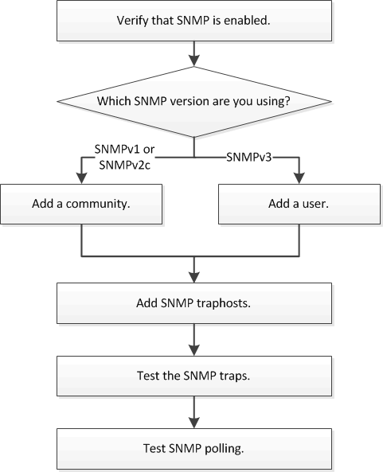

= SNMP configuration workflow
:icons: font
:imagesdir: ../media/

[.lead]
Configuring SNMP involves enabling SNMP, optionally configuring an SNMPv1 or SNMPv2c community, optionally adding an SNMPv3 user, adding SNMP traphosts, and testing SNMP polling and traps.

