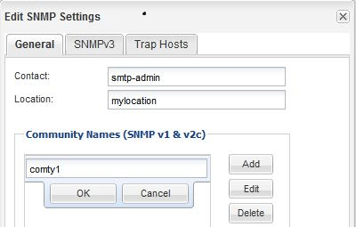

= Add an SNMP community
:icons: font
:imagesdir: ../media/

[.lead]
You can use the System Manager to add a community to the administrative storage virtual machine (SVM) for a cluster that is running SNMPv1 or SNMPv2c. System Manager uses SNMP protocols SNMPv1 and SNMPv2c, and an SNMP community to discover storage systems.

.About this task

This procedure is for adding an SNMP community to the administrative SVM for the cluster. The procedure for adding an SNMP community to a data SVM is described in the networking documentation.

https://docs.netapp.com/us-en/ontap/networking/index.html[Network management]

In new installations of ONTAP, SNMPv1 and SNMPv2c are disabled by default. SNMPv1 and SNMPv2c are enabled when you create an SNMP community.

.Steps

. In the SNMP window, click *Edit* to open the *Edit SNMP Settings* dialog box.
. In the *General* tab, specify the contact personnel and location for the ONTAP system.
. Click *Add*, enter a community name, and then click *OK* in the *Community Names* pane.
+
You can add multiple community names. A community name can be a maximum of 32 characters and must not contain the following special characters: `, / : " ' |`
+

. When you finish adding community names, click *OK* in the *Edit SNMP Settings* dialog box.
