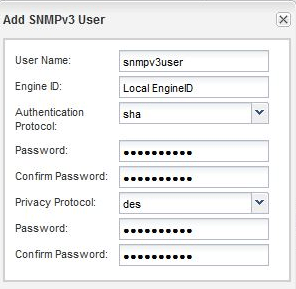

= Adding an SNMPv3 security user
:icons: font
:imagesdir: ../media/

[.lead]
SNMPv3 offers advanced security by using passphrases and encryption. You can use the System Manager to add an SNMPv3 user at the cluster level. The SNMPv3 user can run SNMP utilities from the traphost (SNMP manager) using the authentication and privacy settings that you specify.

== About this task

When you add an SNMPv3 user at the cluster level, that user can access the cluster through all the LIFs that have the `mgmt` firewall policy applied.

== Steps

. In the SNMP window, click *Edit* to open the *Edit SNMP Settings* dialog box.
. In the *SNMPv3* tab, click *Add* to open the *Add SNMPv3 User* dialog box.
. Enter the following values:
 .. Enter an SNMPv3 user name.
+
A security user name must not exceed 31 characters and must not contain the following special characters:
+
`, / : " ' |`

 .. For Engine ID, select the default value `Local Engine ID`
+
The Engine ID is used to generate authentication and encryption keys for SNMPv3 messages.

 .. Select an authentication protocol and enter an authentication password.
+
A password must contain a minimum of eight characters.

 .. Optional: Select a privacy protocol and enter a password for it.

+

. Click *OK* in the *Add SNMPv3 User* dialog box.
+
You can add multiple security user names, clicking *OK* after each addition. For example, if you use SNMP to monitor different applications that require different privileges, you might need to add an SNMPv3 user for each monitoring or management function.

. When you finish adding user names, click *OK* in the *Edit SNMP Settings* dialog box.
