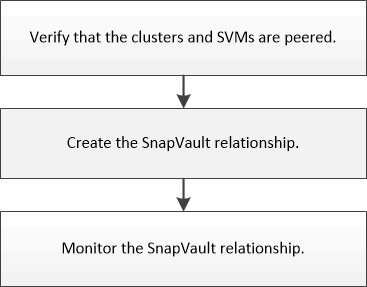

= SnapVault backup configuration workflow
:icons: font
:imagesdir: ../media/

[.lead]
Configuring a SnapVault backup relationship includes verifying the cluster peer relationship, creating the SnapVault relationship between the source and the destination volumes, and monitoring the SnapVault relationship.

