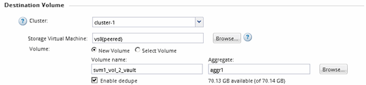
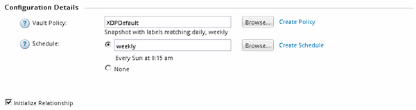
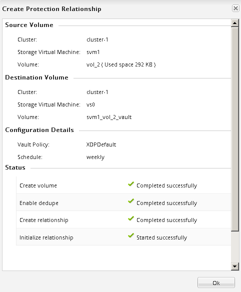
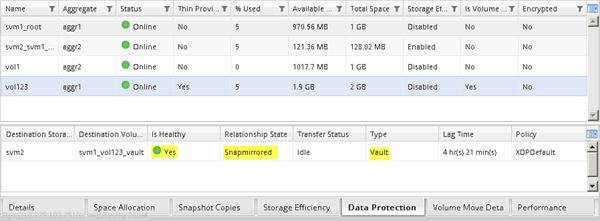

= Create the SnapVault relationship (ONTAP 9.2 or earlier)
:icons: font
:imagesdir: ../media/

[.lead]
You must create a SnapVault relationship between the source volume on one cluster and the destination volume on the peered cluster to create a SnapVault backup.

.Before you begin

* You must have the cluster administrator user name and password for the destination cluster.
* The destination aggregate must have available space.

.About this task

You must perform this task from the *source* cluster.

.Steps

. Click *Storage* > *SVMs*.
. Select the SVM, and then click *SVM Settings*.
. Click the *Volumes* tab.
. Select the volume that you want to back up, and then click *Protect*.
. In the *Create Protection Relationship* dialog box, select *Vault* from the *Relationship Type* drop-down list.
. In the *Destination Volume* section, select the peered cluster.
. Specify the SVM for the destination volume:
+
[options="header"]
|===
| If the SVM is...| Then...
a|
Peered
a|
Select the peered SVM from the list.
a|
Not peered
a|

 .. Select the SVM.
 .. Click *Authenticate*.
 .. Enter the cluster administrator's credentials of the peered cluster, and then click *Create*.

+
|===

. Create a new destination volume:
 .. Select the *New Volume* option.
 .. Use the default volume name or enter a new volume name.
 .. Select the destination aggregate.
 .. Ensure that the *Enable dedupe* check box is selected.

+

. In the *Configuration Details* section, select `XDPDefault` as the protection policy.
. Select a protection schedule from the list of schedules.
. Ensure that the *Initialize Relationship* check box is selected to transfer the base Snapshot copy, and then click *Create*
+

+
The wizard creates the relationship with the specified vault policy and schedule. The relationship is initialized by starting a baseline transfer of data from the source volume to the destination volume.
+
The Status section shows the status of each job.
+

. Verify that the relationship status of the SnapVault relationship is in the `Snapmirrored` state.
 .. Select the volume from the Volumes list, and then click *Data Protection*.
 .. In the *Data Protection* bottom tab, verify that the SnapMirror relationship you created is listed and the relationship state is `Snapmirrored` and type is `Vault`.
+

