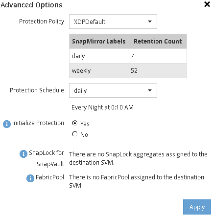

= Creating a SnapVault relationship (starting with ONTAP 9.3)
:icons: font
:imagesdir: ../media/

[.lead]
You must create a SnapVault relationship between the source volume on one cluster and the destination volume on the peered cluster to create a SnapVault backup.

== Before you begin

* You must have the cluster administrator user name and password for the destination cluster.
* The destination aggregate must have available space.

== About this task

You must perform this task from the *source* cluster.

== Steps

. Click *Storage* > *Volumes*.
. Select the volume that you want to back up, and then click *Actions* > *Protect*.
+
You can also select multiple source volumes, and then create SnapVault relationships with a single destination volume.

. In the *Volumes: Protect Volumes* page, provide the following information:
 .. Select *Vault* from the *Relationship Type* drop-down list.
 .. Select the destination cluster, destination SVM, and the suffix for the destination volume.
+
Only peered SVMs and permitted SVMs are listed under destination SVMs.
+
The destination volume is automatically created. The name of the destination volume is the source volume name appended with the suffix.

 .. Click image:../media/advanced_options_icon_backup.gif[].
 .. In the *Advanced Options* dialog box, verify that the *Protection Policy* is set as `XDPDefault`.
 .. Select the *Protection Schedule*.
+
By default, the `daily` schedule is selected.

 .. Verify that *Yes* is selected for initializing the SnapVault relationship.
+
All data protection relationships are initialized by default.

 .. Click *Apply* to save the changes.
+

. In the *Volumes: Protect Volumes* page, click *Validate* to verify whether the volumes have matching SnapMirror labels.
. Click *Save* to create the SnapVault relationship.
. Verify that the status of the SnapVault relationship is in the `Snapmirrored` state.
 .. Navigate to the *Volumes* window, and then select the volume that is backed up.
 .. Expand the volume and click *PROTECTION* to view the data protection status of the volume.

+
image::../media/snapvault_9_3.gif[]
