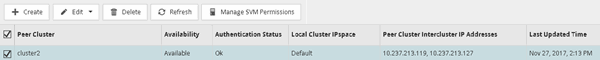
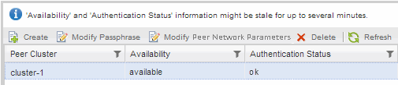

= Verify cluster peer relationship and SVM peer relationship
:icons: font
:imagesdir: ../media/

[.lead]
Before you set up a volume for data protection by using SnapVault technology, you must verify that the source cluster and destination cluster are peered and are communicating with each other through the peer relationship. You must also verify that the source SVM and destination SVM are peered and are communicating with each other through the peer relationship.

.About this task

You must perform this task from the *source* cluster.

== Procedure

* If you are running ONTAP 9.3 or later, perform the following steps to verify the cluster peer relationship and SVM peer relationship:
 .. Click *Configuration* > *Cluster Peers*.
 .. Verify that the peered cluster is authenticated and is available.
+

 .. Click *Configuration* > *SVM Peers*.
 .. Verify that the destination SVM is peered with the source SVM.
* If you are running ONTAP 9.2 or earlier, perform the following steps to verify the cluster peer relationship and SVM peer relationship:
 .. Click the *Configurations* tab.
 .. In the *Cluster Details* pane, click *Cluster Peers*.
 .. Verify that the peered cluster is authenticated and available.
+

 .. Click the *SVMs* tab and select the source SVM.
 .. In the *Peer Storage Virtual Machines* area, verify the destination SVM is peered with the source SVM.
+
If you do not see any peered SVM in this area, you can create the SVM peer relationship when creating the SnapVault relationship.

+
xref:task_creating_snapvault_relationship_92_earlier.adoc[Creating the SnapVault relationship (ONTAP 9.2 or earlier)]
