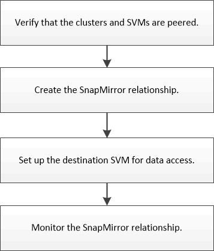

= Volume disaster recovery preparation workflow
:icons: font
:imagesdir: ../media/

[.lead]
Preparing volumes for disaster recovery involves verifying the cluster peer relationship, creating the SnapMirror relationship between volumes residing on peered clusters, setting up the destination SVM for data access, and monitoring the SnapMirror relationship periodically.

