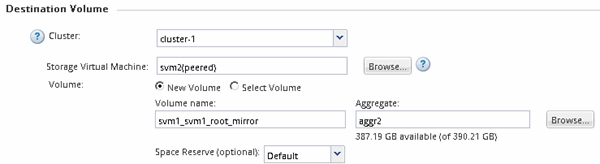
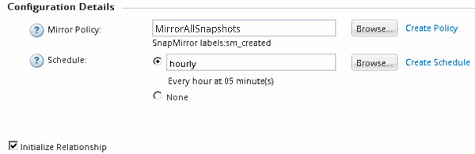
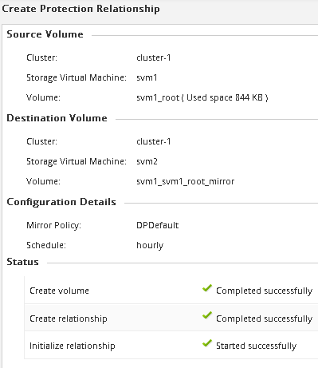
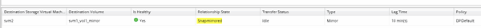

= Create the SnapMirror relationship (ONTAP 9.2 or earlier)
:icons: font
:imagesdir: ../media/

[.lead]
You must create a SnapMirror relationship between the source volume on one cluster and the destination volume on the peered cluster for replicating data for disaster recovery.

.Before you begin

* You must have the cluster administrator user name and password for the destination cluster.
* The destination aggregate must have available space.
* Both the clusters must be configured and set up appropriately to meet the requirements of your environment for user access, authentication, and client access.

.About this task

You must perform this task from the *source* cluster.

.Steps

. Click *Storage* > *SVMs*.
. Select the SVM, and then click *SVM Settings*.
. Click the *Volumes* tab.
. Select the volume for which you want to create a mirror relationship, and then click *Protect*.
+
The Create Protection Relationship window is displayed.

. In the *Relationship Type* section, select *Mirror* from the *Relationship Type* drop-down list.
. In the *Destination Volume* section, select the peered cluster.
. Specify the SVM for the destination volume:
+
|===
| If the SVM is...| Then...
a|
Peered
a|
Select the peered SVM from the list.
a|
Not peered
a|

 .. Select the SVM.
 .. Click *Authenticate*.
 .. Enter the cluster administrator's credentials of the peered cluster, and then click *Create*.

+
|===

. Create a new destination volume:
 .. Select the *New Volume* option.
 .. Use the default volume name or specify a new volume name.
 .. Select the destination aggregate.

+

. In the *Configuration Details* section, select *MirrorAllSnapshots* as the mirror policy.
+
`DPDefault` and `MirrorLatest` are the other default mirror policies that are available for SnapMirror relationships.

. Select a protection schedule from the list of schedules.
. Ensure that the *Initialize Relationship* check box is selected, and then click *Create*.
+
Initializing the SnapMirror relationship ensures that the destination volume has a baseline to start protecting the source volume.
+

+
The relationship is initialized by starting a baseline transfer of data from the source volume to the destination volume.
+
The initialization operation might take some time. The Status section shows the status of each job.
+

. Verify the relationship status of the SnapMirror relationship:
 .. Select the volume for which you created the SnapMirror relationship from the *Volumes* list, and then click *Data Protection*.
 .. In the *Data Protection* tab, verify that the SnapMirror relationship that you created is listed and that the relationship state is `Snapmirrored`.
+

== What to do next

You must make a note of the settings for the source volume such as thin provisioning, deduplication, compression, and autogrow. You can use this information to verify the destination volume settings when you break the SnapMirror relationship.
